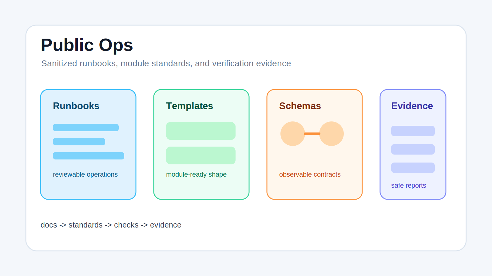

# Public Ops



Public Ops is a sanitized operations workspace: runbooks, module templates, observability schemas, verification notes, and safe evidence references for infrastructure and automation work.

## What It Does

- Presents public-safe operational docs and templates.
- Keeps module onboarding conventions in one place.
- Includes observability event and health schemas.
- Carries safe verification reports and rollout notes.
- Shows how automation pieces fit together without exposing private runtime material.

## Highlights

- **Runbook-first structure:** docs are organized around operational actions and verification.
- **Reusable module templates:** new modules can follow shared README, runbook, and manifest patterns.
- **Evidence-oriented workflow:** reports and checks make operational changes reviewable.
- **Sanitized public surface:** private or risky source material is removed before public staging.

## Quick Start

Start with the public module onboarding guide:

```text
docs/onboarding/ADDING_A_MODULE.md
```

Then review the shared templates:

```text
standards/templates/README.module.md
standards/templates/RUNBOOK.module.md
standards/templates/module.yaml
```

## Project Map

| Path | Purpose |
| --- | --- |
| `docs/` | Runbooks, onboarding, architecture, and public references |
| `standards/schemas/` | Observability event and health schemas |
| `standards/templates/` | Reusable module README, runbook, and manifest templates |
| `automation/task-executor/` | Public automation scheduler package |
| `ops/reports/` | Safe evidence and verification reports |
| `tools/import/` | Utility scripts for import and integrity checks |

## Testing

Representative checks in this public copy include shell-based contract tests and evidence validation scripts. Use the test scripts at the repository root for focused checks, and inspect JSON reports under `ops/reports/` when validating operational behavior.

## Notes

This repository is a public presentation of operational structure and safe evidence. It intentionally omits private secrets, private runtime configuration, and source material that should not be published.

