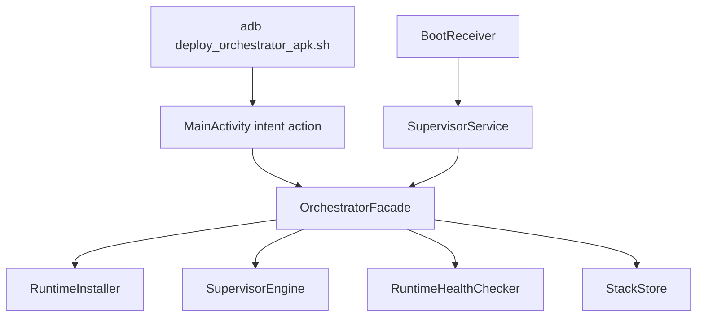
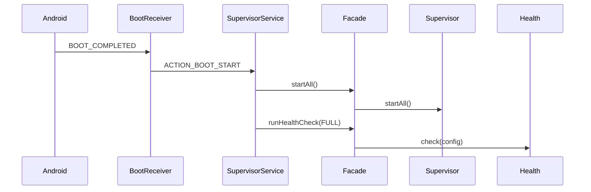
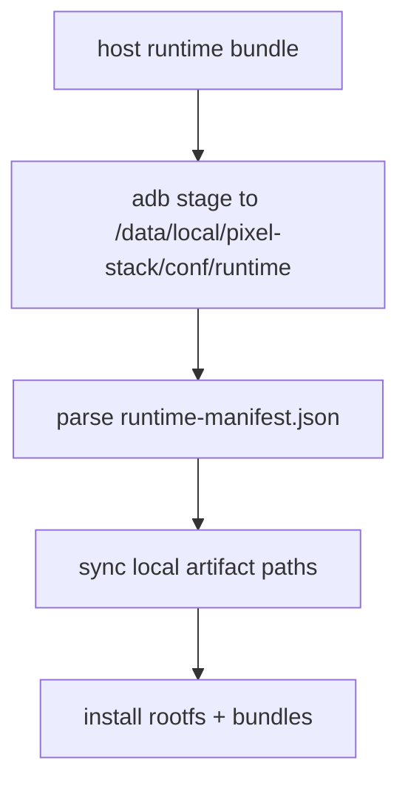

# Pixel Root Orchestrator: Architecture + Redeploy Manual (Canonical)

This is the canonical manual for architecture, deployment, cutover, operations, and recovery.
All other runbooks/docs are compatibility pointers to this file plus generated references.

## Table of Contents

- [Purpose and Scope](#purpose-and-scope)
- [System Context and Ownership Boundaries](#system-context-and-ownership-boundaries)
- [Architecture Overview (Control Plane + Runtime Plane)](#architecture-overview-control-plane--runtime-plane)
- [Runtime Topology and Filesystem Layout](#runtime-topology-and-filesystem-layout)
- [Android Orchestrator Module Internals](#android-orchestrator-module-internals)
- [Boot and Lifecycle Flow](#boot-and-lifecycle-flow)
- [Component Deep Dives](#component-deep-dives)
- [Health Model and Evidence Keys](#health-model-and-evidence-keys)
- [Configuration and Secrets Contract](#configuration-and-secrets-contract)
- [Artifact Trust Chain and Release Pipeline](#artifact-trust-chain-and-release-pipeline)
- [Redeploy Philosophy](#redeploy-philosophy)
- [Bootstrap Deployment](#bootstrap-deployment)
- [Day-2 Operations (Full + Component-Scoped Actions)](#day-2-operations-full--component-scoped-actions)
- [Hard Cutover and Legacy Owner Cleanup](#hard-cutover-and-legacy-owner-cleanup)
- [Reboot Validation](#reboot-validation)
- [Rollback and Disaster Recovery](#rollback-and-disaster-recovery)
- [Troubleshooting Matrix](#troubleshooting-matrix)
- [Security and Credential Rotation](#security-and-credential-rotation)
- [Quick Command Index](#quick-command-index)
- [References](#references)

<a id="purpose-and-scope"></a>
## Purpose and Scope

This repository manages rooted Pixel runtime ownership for:
- DNS (`dns`)
- SSH (`ssh`)
- VPN (`vpn`)
- Dynamic DNS (`ddns`)
- Remote endpoint runtime checks (`remote`)
- Train bot (`train_bot`)
- Site notifier (`site_notifier`)

Ownership is centralized in the Android app orchestrator and managed root scripts under `/data/local/pixel-stack`.

### Normal Redeploy Path

Use the smart wrapper for normal production redeploys. It builds current artifacts, chooses bootstrap vs targeted redeploy automatically, runs validation, and writes a machine-readable report under `output/pixel/redeploy/`.

```bash
export PIXEL_TRANSPORT=ssh
export PIXEL_SSH_HOST="<tailnet-ip>"
export PIXEL_DEVICE_SSH_PASSWORD="<root-ssh-password>"

bash tools/pixel/check_ssh_ready.sh --ssh-host "${PIXEL_SSH_HOST}"
./tools/pixel/redeploy.sh --transport ssh --ssh-host "${PIXEL_SSH_HOST}"
```

Use flags only when you need a narrower or recovery-oriented run:

```bash
./tools/pixel/redeploy.sh --scope dns --transport ssh --ssh-host "${PIXEL_SSH_HOST}"
./tools/pixel/redeploy.sh --scope train_bot --transport ssh --ssh-host "${PIXEL_SSH_HOST}"
./tools/pixel/redeploy.sh --mode validate-only --transport ssh --ssh-host "${PIXEL_SSH_HOST}"
./tools/pixel/redeploy.sh --mode force-bootstrap --transport ssh --ssh-host "${PIXEL_SSH_HOST}"
```

ADB fallback remains supported:

```bash
export PIXEL_TRANSPORT=adb
export ADB_SERIAL="<adb-serial>"

./tools/pixel/redeploy.sh --scope train_bot --transport adb --device "${ADB_SERIAL}"
```

### Recovery-Only Manual Redeploy Path

Use this only when the smart wrapper is unavailable or when you need to isolate a low-level failure mode manually.

```bash
set -euo pipefail

export PIXEL_TRANSPORT=ssh
export PIXEL_SSH_HOST="<tailnet-ip>"
export PIXEL_DEVICE_SSH_PASSWORD="<root-ssh-password>"
export COMPONENT_ID="<train_bot|site_notifier|dns|ssh|vpn|ddns|remote>"
export COMPONENT_RELEASE_DIR=".artifacts/component-releases/${COMPONENT_ID}-<release-id>"

bash tools/pixel/check_ssh_ready.sh --ssh-host "${PIXEL_SSH_HOST}"

bash orchestrator/scripts/android/deploy_orchestrator_apk.sh \
  --transport ssh \
  --ssh-host "${PIXEL_SSH_HOST}" \
  --component-release-dir "${COMPONENT_RELEASE_DIR}" \
  --action redeploy_component \
  --component "${COMPONENT_ID}"

bash orchestrator/scripts/android/deploy_orchestrator_apk.sh --transport ssh --ssh-host "${PIXEL_SSH_HOST}" --action health_component --component "${COMPONENT_ID}" --skip-build
bash orchestrator/scripts/android/deploy_orchestrator_apk.sh --transport ssh --ssh-host "${PIXEL_SSH_HOST}" --action health --skip-build
```

Use `bootstrap` only for first install, clean-room reprovisioning, or intentional shared-platform changes. Use `restart_component` only for runtime control on the already deployed release.

<a id="system-context-and-ownership-boundaries"></a>
## System Context and Ownership Boundaries

`pixel-ops` monorepo is the orchestration source repo.

In-scope ownership:
- App/APK orchestration and intent action surface
- Runtime installation, artifact verification, env materialization
- Service lifecycle loops and health synthesis
- Boot startup path (`BootReceiver` + `SupervisorService`)

Out-of-scope ownership:
- Workload source logic for sibling repos (train/site apps)
- Legacy independent autostart scripts (must remain disabled after cutover)

Canonical runtime root:
- `/data/local/pixel-stack`

Canonical config/secrets root:
- `/data/local/pixel-stack/conf`

<a id="architecture"></a>
<a id="architecture-overview-control-plane--runtime-plane"></a>
## Architecture Overview (Control Plane + Runtime Plane)

### Control Plane



### Runtime Plane

```mermaid
flowchart LR
  A[/data/local/pixel-stack/bin entrypoints/] --> B[/templates service loops/launchers/]
  B --> C[dns runtime]
  B --> D[ssh runtime]
  B --> E[train_bot runtime]
  B --> F[site_notifier runtime]
  G[/data/local/pixel-stack/conf/] --> A
  H[/runtime-manifest.json (local)/] --> I[artifact sync from local paths]
  I --> J[chroot + bundles install]
```

<a id="runtime-layout"></a>
<a id="runtime-topology-and-filesystem-layout"></a>
## Runtime Topology and Filesystem Layout

Core runtime paths:
- `/data/local/pixel-stack/bin`: orchestrator entrypoints (`pixel-dns-*`, `pixel-ssh-*`, `pixel-ddns-sync.sh`, `pixel-train-*`, `pixel-notifier-*`)
- `/data/local/pixel-stack/templates`: runtime templates for rooted/ssh/train/notifier loops
- `/data/local/pixel-stack/conf`: config/env/secrets root
- `/data/local/pixel-stack/run`: runtime state and pid artifacts
- `/data/local/pixel-stack/logs`: runtime logs
- `/data/local/pixel-stack/apps/train-bot`: train runtime root with `releases/` and `current`
- `/data/local/pixel-stack/apps/site-notifications`: notifier runtime root with `releases/` and `current`
- `/data/local/pixel-stack/apps/train-bot/releases`: immutable Train Bot releases; keep current plus previous rollback slots
- `/data/local/pixel-stack/apps/site-notifications/releases`: immutable Site Notifier releases; keep current plus previous rollback slots
- `/data/local/pixel-stack/chroots/adguardhome`: AdGuard Home rootfs
- `/data/local/pixel-stack/backups`: cutover backups

App-private persisted state:
- `<app-files-dir>/stack-store/orchestrator-config-v1.json`
- `<app-files-dir>/stack-store/orchestrator-state-v1.json`

<a id="module-internals"></a>
<a id="android-orchestrator-module-internals"></a>
## Android Orchestrator Module Internals

Project path: `orchestrator/android-orchestrator/`

Modules:
- `app`: UI action routing, boot receiver, foreground supervisor service, orchestration facade
- `core-config`: typed config/state model + serialization
- `root-exec`: `su` command abstraction
- `runtime-installer`: artifact verification/sync/install + layout
- `supervisor`: component lifecycle + restart/backoff policies
- `health`: runtime probe parsing and health snapshot synthesis

Primary wiring:
- `AppGraph.kt` constructs facade, installer, checker, supervisor, and component controllers.
- `MainActivity.kt` handles explicit action intents and manual control actions.
- `SupervisorService.kt` runs boot-triggered and background lifecycle actions.

<a id="boot-and-lifecycle-flow"></a>
## Boot and Lifecycle Flow

Boot path:
1. Android emits `BOOT_COMPLETED` or `MY_PACKAGE_REPLACED`.
2. `BootReceiver` starts `SupervisorService` with boot action.
3. `SupervisorService` calls `facade.startAll()` then full health check.
4. `SupervisorEngine` starts managed components and enters poll loop.

Intent action path:
1. `deploy_orchestrator_apk.sh` starts `MainActivity` with `orchestrator_action` extras.
2. `MainActivity` handles in `onCreate` and `onNewIntent`.
3. `OrchestratorFacade` dispatches to install/start/stop/restart/health methods.



<a id="component-lifecycle"></a>
<a id="component-deep-dives"></a>
## Component Deep Dives

### dns
- Entrypoint: `runtime/entrypoints/pixel-dns-start.sh`, `pixel-dns-stop.sh`
- Loop template: `runtime/templates/rooted/adguardhome-service-loop`
- Launch templates: `runtime/templates/rooted/adguardhome-render-config`, `adguardhome-launch-core`, `adguardhome-launch-frontend`, `adguardhome-start`, `adguardhome-stop`
- Health signal: core health is local listener readiness (`53`, `127.0.0.1:8080`, and internal DoT `8853` when nginx fronts public DoT), with remote listener health delegated to `adguardhome-start --remote-healthcheck` when remote features are enabled
- Encrypted DNS identity control:
  - Host wrapper: `/data/local/pixel-stack/bin/pixel-dns-identityctl`
  - Chroot entrypoint: `/usr/local/bin/adguardhome-doh-identityctl`
  - Web sidecar: `/usr/local/bin/adguardhome-doh-identity-web.py`
  - Web endpoints (proxied on remote frontend): `/pixel-stack/identity`, `/pixel-stack/identity/api/v1/*`, `/pixel-stack/identity/inject.js`
  - Settings entry label: `DNS identities`
  - Identity store: `/etc/pixel-stack/remote-dns/doh-identities.json`
  - Usage ledger/cursor: `/etc/pixel-stack/remote-dns/state/doh-usage-events.jsonl`, `/etc/pixel-stack/remote-dns/state/doh-usage-cursor.json`
  - DoT identity rollout: when `remote.dotIdentityEnabled=true`, each identity can also receive a randomized DoT hostname under `*.dns.jolkins.id.lv` using `remote.dotIdentityLabelLength` (currently `20` in production)

### ssh
- Entrypoint: `runtime/entrypoints/pixel-ssh-start.sh`, `pixel-ssh-stop.sh`
- Loop template: `runtime/templates/ssh/pixel-ssh-service-loop.sh`
- Launch template: `runtime/templates/ssh/pixel-ssh-launch.sh`
- Runtime root: `/data/local/pixel-stack/ssh`
- Health signal: listener on `ssh.port` (default `2222`) with VPN guard chains (`PIXEL_SSH_GUARD`, `PIXEL_SSH_GUARD6`)

### vpn
- Entrypoint: `runtime/entrypoints/pixel-vpn-start.sh`, `pixel-vpn-stop.sh`, `pixel-vpn-health.sh`
- Loop template: `runtime/templates/vpn/pixel-vpn-service-loop.sh`
- Launch template: `runtime/templates/vpn/pixel-vpn-launch.sh`
- Runtime root: `/data/local/pixel-stack/vpn`
- Health signal: `pixel-vpn-health.sh` (tailscaled pid + socket + `tailscale0` + `tailscale ip -4`)

### ddns
- Entrypoint: `runtime/entrypoints/pixel-ddns-sync.sh`
- One-shot sync action managed via orchestrator
- Health signal: freshness of `/data/local/pixel-stack/run/ddns-last-sync-epoch`

### remote
- No dedicated owner loop; health is derived from listener checks based on remote feature flags
- Used for remote endpoint contract validation in health/supervision snapshots
- DNS-owned remote listener health is delegated to `adguardhome-start --remote-healthcheck`
- The rooted DNS service loop attempts targeted frontend recovery via `adguardhome-start --remote-restart` before escalating to a full runtime restart
- DoH contract probes are non-query path checks (`/dns-query` and `/<token>/dns-query`), so watchdog/health probes do not add loopback DNS question rows to AdGuard querylog

### train_bot
- Entrypoint: `runtime/entrypoints/pixel-train-start.sh`, `pixel-train-stop.sh`
- Loop template: `runtime/templates/train/train-service-loop.sh`
- Launch template: `runtime/templates/train/train-launch.sh`
- PID/lock/heartbeat:
  - PID: `/data/local/pixel-stack/apps/train-bot/run/train-bot.pid`
  - Lock dir: `/data/local/pixel-stack/apps/train-bot/run/train-bot-service-loop.lock`
  - Heartbeat: `/data/local/pixel-stack/apps/train-bot/run/heartbeat.epoch`

### site_notifier
- Entrypoint: `runtime/entrypoints/pixel-notifier-start.sh`, `pixel-notifier-stop.sh`
- Loop template: `runtime/templates/notifier/notifier-service-loop.sh`
- Launch template: `runtime/templates/notifier/notifier-launch.sh`
- PID/lock/heartbeat:
  - PID: `/data/local/pixel-stack/apps/site-notifications/run/site-notifier.pid`
  - Lock dir: `/data/local/pixel-stack/apps/site-notifications/run/site-notifier-service-loop.lock`
  - Heartbeat: `/data/local/pixel-stack/apps/site-notifications/run/heartbeat.epoch`
- Runtime context policy exported for orchestrator mode: `RUNTIME_CONTEXT_POLICY=orchestrator_root`

### Restart/Backoff behavior
- Service loops implement single-instance lock checks, stale-lock cleanup, rapid restart caps, and exponential backoff.
- Supervisor loop monitors health and can trigger component restarts according to supervision policy.

<a id="health-model-and-evidence-keys"></a>
## Health Model and Evidence Keys

Health snapshot booleans:
- `rootGranted`
- `dnsHealthy`
- `remoteHealthy`
- `sshHealthy`
- `vpnHealthy`
- `trainBotHealthy`
- `siteNotifierHealthy`
- `ddnsHealthy`
- `supervisorHealthy`

Current app-health criteria:
- train bot healthy only if process present and heartbeat age `<= 120s`
- site notifier healthy only if process present and heartbeat age `<= 120s`

Important evidence keys:
- `id_u`: root execution identity check (`0` expected)
- `listeners_ok`: probe parse success flag
- `train_bot_pid`: detected train process pid
- `train_bot_heartbeat_age_sec`: heartbeat age in seconds (`unknown` if missing/unparseable)
- `site_notifier_pid`: detected notifier process pid
- `site_notifier_heartbeat_age_sec`: heartbeat age in seconds (`unknown` if missing/unparseable)
- `dns_port`, `ssh_port`, `https_port`, `dot_port`, `doh_internal_port`: effective check ports
- `doh_probe_mode`: DoH probe contract flavor (`no_query_http_contract`)

<a id="configuration-and-secrets-contract"></a>
## Configuration and Secrets Contract

Canonical config file:
- `/data/local/pixel-stack/conf/orchestrator-config-v1.json`

Template source:
- `orchestrator/templates/orchestrator/orchestrator-config-v1.example.json`

Config sections:
- `runtime`, `dns`, `remote`, `ssh`, `vpn`, `trainBot`, `siteNotifier`, `ddns`, `supervision`, `features`

Canonical secrets/env materialization:
- SSH keys: `/data/local/pixel-stack/conf/ssh/authorized_keys`
- SSH password hash: `/data/local/pixel-stack/conf/ssh/root_password.hash`
- VPN auth key: `/data/local/pixel-stack/conf/vpn/tailscale-authkey`
- DDNS token: `/data/local/pixel-stack/conf/ddns/cloudflare-token`
- Remote admin password: `/data/local/pixel-stack/conf/adguardhome/remote-admin-password`
- Train env source: `/data/local/pixel-stack/conf/apps/train-bot.env`
- Notifier env source: `/data/local/pixel-stack/conf/apps/site-notifications.env`

Orchestrator writes derived env files for runtime loops (AdGuardHome/SSH/DDNS and app loops).

<a id="artifact-signing-pipeline"></a>
<a id="artifact-trust-chain-and-release-pipeline"></a>
## Runtime Bundle Staging Pipeline

Bootstrap bundle artifacts required by manifest:
- `adguardhome-rootfs`
- `dropbear-bundle`
- `tailscale-bundle`
- `train-bot-bundle`
- `site-notifier-bundle`

Single-component release artifacts are staged separately from the bootstrap bundle. A component release manifest contains:
- `schema`
- `componentId`
- `releaseId`
- `signatureSchema`
- `artifacts`

Device staging root for a single-component release:
- `/data/local/pixel-stack/conf/runtime/components/<component>/release-manifest.json`
- `/data/local/pixel-stack/conf/runtime/components/<component>/artifacts/*`

Staging chain:
1. Build a local runtime bundle on host (`runtime-manifest.json` + `artifacts/*.tar`).
2. Stage bundle to device with `deploy_orchestrator_apk.sh --runtime-bundle-dir`.
3. Validate required manifest entries and local artifact path format.
4. Sync local artifact paths into app cache.
5. Install runtime assets into `/data/local/pixel-stack`.
6. `bootstrap` is the only action that consumes the full runtime bundle.
   Day-2 single-service updates use `redeploy_component`, which syncs only the target component surface.
   `restart_component` is lifecycle-only and must not be used as an update shortcut.



Bundle packaging command:

```bash
bash orchestrator/scripts/android/package_runtime_bundle.sh \
  --rootfs-tarball "<adguardhome-rootfs-arm64.tar>" \
  --dropbear-artifact-dir "<dropbear-artifact-dir>" \
  --tailscale-bundle "<tailscale-bundle.tar>" \
  --train-bot-bundle "<train-bot-bundle.tar>" \
  --site-notifier-bundle "<site-notifier-bundle.tar>" \
  --out-dir ".artifacts/runtime-local/<bundle-version>"
```

Component release packaging command:

```bash
bash orchestrator/scripts/android/package_component_release.sh \
  --component "<component-id>" \
  --release-id "<release-id>" \
  --artifact "<artifact-id>=<artifact-path>" \
  --out-dir ".artifacts/component-releases/<component-id>-<release-id>"
```

Bootstrap with staged local bundle:

```bash
bash orchestrator/scripts/android/deploy_orchestrator_apk.sh \
  --device "<adb-serial>" \
  --runtime-bundle-dir ".artifacts/runtime-local/<bundle-version>" \
  --action bootstrap
```

Component redeploy with staged release:

```bash
bash orchestrator/scripts/android/deploy_orchestrator_apk.sh \
  --device "<adb-serial>" \
  --component-release-dir ".artifacts/component-releases/<component-id>-<release-id>" \
  --action redeploy_component \
  --component "<component-id>"
```

<a id="redeploy-philosophy"></a>
## Redeploy Philosophy

Default contract:
- `bootstrap` is for clean-room provisioning, first install, or intentional shared-platform changes.
- `redeploy_component` is the canonical path for updating exactly one service or job.
- `restart_component` is runtime control only. It must not be used as a release/install shortcut.
- A single-service redeploy may mutate only the target-owned runtime and config surface.
- A redeploy is considered safe only if previously healthy non-target components remain healthy after the mutation.

Ownership rules:
- `dns`, `ssh`, `vpn`, `train_bot`, and `site_notifier` are independently redeployable owners.
- `ddns` is a job. Redeploy means refresh its owned inputs and execute the job once.
- `remote` is a derived component owned by `dns`. `redeploy_component remote` is a DNS-owned alias and must gate both `dns` and `remote`.
- Every new app must own a dedicated mutable runtime root and must not share mutable runtime dependencies with siblings.
- The default app pattern is immutable releases under `releases/<releaseId>/` with an atomically switched `current` pointer.
- Shared chroot/runtime dependencies are legacy compatibility paths, not the default architecture for future apps.

<a id="bootstrap"></a>
<a id="bootstrap-deployment"></a>
## Bootstrap Deployment

### Clean-room redeploy prerequisites

- Rooted Pixel with working `su`
- `adb` connectivity to device
- Host tools: `adb`, `bash`, `jq`, `curl`, `dig`, `nc`
- Prepared runtime inputs:
  - runtime bundle dir (`runtime-manifest.json` + `artifacts/`)
  - orchestrator config JSON
  - SSH public key + password hash
  - train env file
  - site notifier env file
  - optional DDNS token/admin password

### Build APK

```bash
bash orchestrator/scripts/android/build_orchestrator_apk.sh
```
### Bootstrap command

```bash
set -euo pipefail

export ADB_SERIAL="<adb-serial>"
export CONFIG_FILE="<config-json>"
export SSH_PUBLIC_KEY_FILE="<authorized-keys-file>"
export SSH_PASSWORD_HASH_FILE="<root-password-hash-file>"
export VPN_AUTH_KEY_FILE="<tailscale-auth-key-file>"
export TRAIN_BOT_ENV_FILE="<train-bot-env-file>"
export SITE_NOTIFIER_ENV_FILE="<site-notifier-env-file>"
export DDNS_TOKEN_FILE="<ddns-token-file-optional>"
export ADMIN_PASSWORD_FILE="<remote-admin-password-file-optional>"
export RUNTIME_BUNDLE_DIR="<runtime-bundle-dir>"

bash orchestrator/scripts/android/deploy_orchestrator_apk.sh \
  --device "${ADB_SERIAL}" \
  --runtime-bundle-dir "${RUNTIME_BUNDLE_DIR}" \
  --action bootstrap \
  --config-file "${CONFIG_FILE}" \
  --ssh-public-key "${SSH_PUBLIC_KEY_FILE}" \
  --ssh-password-hash-file "${SSH_PASSWORD_HASH_FILE}" \
  --vpn-auth-key-file "${VPN_AUTH_KEY_FILE}" \
  --train-bot-env-file "${TRAIN_BOT_ENV_FILE}" \
  --site-notifier-env-file "${SITE_NOTIFIER_ENV_FILE}" \
  --ddns-token-file "${DDNS_TOKEN_FILE}" \
  --admin-password-file "${ADMIN_PASSWORD_FILE}"
```

### Immediate health validation

```bash
bash orchestrator/scripts/android/deploy_orchestrator_apk.sh --device "${ADB_SERIAL}" --action health --skip-build
adb -s "${ADB_SERIAL}" shell "su -c 'ss -ltn | grep -E \":53 |:2222 |:443 |:853 \" || true'"
```

<a id="day-2-operations-full--component-scoped-actions"></a>
## Day-2 Operations (Full + Component-Scoped Actions)

Supported actions:
- full-stack provisioning/control: `bootstrap`, `start_all`, `stop_all`, `health`, `export_bundle`
- single-component release: `redeploy_component`
- component lifecycle/control: `start_component`, `stop_component`, `restart_component`, `health_component`
- owned one-shot job execution: `sync_ddns`

Supported components:
- `dns`, `ssh`, `vpn`, `ddns`, `remote`, `train_bot`, `site_notifier`

Operational notes:
- `deploy_orchestrator_apk.sh` now emits advisory runtime-asset hash mismatch warnings (host APK assets vs on-device staged assets) before action launch.
- `redeploy_component` is the default update path for one component. It may stage external config, sync bundled assets for the target only, install only the target release artifact, and then verify healthy neighbors did not regress.
- `restart_component` is for process recovery, log rotation, or config already present on device. It does not represent a release boundary.
- When action implies remote bring-up, deploy script prints `Identity endpoint check: mode=... port=... inject_code=...`.
- In tokenized/dual mode, DNS runtime startup is fail-closed for identity sidecar startup/health failures.
- `remote` is not independently isolated. Treat it as a DNS-owned derived surface for redeploy and health gating.
- `train_bot` and `site_notifier` are expected to deploy immutable releases and switch `current` atomically rather than mutating the active release in place.

Examples:

```bash
bash orchestrator/scripts/android/deploy_orchestrator_apk.sh --device "<adb-serial>" --action start_all --skip-build
bash orchestrator/scripts/android/deploy_orchestrator_apk.sh --device "<adb-serial>" --action stop_all --skip-build
bash orchestrator/scripts/android/deploy_orchestrator_apk.sh --device "<adb-serial>" --action health --skip-build

bash orchestrator/scripts/android/deploy_orchestrator_apk.sh --device "<adb-serial>" --component-release-dir ".artifacts/component-releases/train_bot-<release-id>" --action redeploy_component --component train_bot
bash orchestrator/scripts/android/deploy_orchestrator_apk.sh --device "<adb-serial>" --component-release-dir ".artifacts/component-releases/site_notifier-<release-id>" --action redeploy_component --component site_notifier
bash orchestrator/scripts/android/deploy_orchestrator_apk.sh --device "<adb-serial>" --component-release-dir ".artifacts/component-releases/dns-<release-id>" --action redeploy_component --component remote

bash orchestrator/scripts/android/deploy_orchestrator_apk.sh --device "<adb-serial>" --action restart_component --component ssh --skip-build
bash orchestrator/scripts/android/deploy_orchestrator_apk.sh --device "<adb-serial>" --action restart_component --component vpn --skip-build
bash orchestrator/scripts/android/deploy_orchestrator_apk.sh --device "<adb-serial>" --action restart_component --component train_bot --skip-build
bash orchestrator/scripts/android/deploy_orchestrator_apk.sh --device "<adb-serial>" --action restart_component --component site_notifier --skip-build
```

<a id="hard-cutover"></a>
<a id="hard-cutover-and-legacy-owner-cleanup"></a>
## Hard Cutover and Legacy Owner Cleanup

Use a single maintenance window:
1. Snapshot/export support bundle.
2. Bootstrap orchestrator with centralized config/secrets.
3. Start/validate components (`ssh`, `vpn`, `train_bot`, `site_notifier`).
4. Remove legacy service owners.
5. Re-check health.
6. Reboot and validate orchestrator-owned restart.

Cleanup script:

```bash
bash orchestrator/scripts/ops/hard-cutover-orchestrator-owners.sh --adb-serial "<adb-serial>"
```

Expected legacy paths absent after cutover:
- `/data/adb/service.d/40-telegram-train-bot.sh`
- legacy notifier boot/autostart script under the previous app-private home

Post-cleanup check:

```bash
bash orchestrator/scripts/android/deploy_orchestrator_apk.sh --device "<adb-serial>" --action health --skip-build
```

### Immediate VPN Cutover Safety

For immediate VPN-only SSH cutover, keep a live adb session (`adb shell` + `su`) before restarting `vpn` and `ssh`.
If tailnet bootstrap fails and WAN SSH is blocked, run:

```bash
bash orchestrator/scripts/ops/vpn_break_glass_ssh.sh --adb-serial "<adb-serial>" --duration-sec 600
```

<a id="reboot-validation"></a>
## Reboot Validation

```bash
adb -s "<adb-serial>" reboot
adb connect "<phone-ip>:5555"
adb -s "<adb-serial>" wait-for-device

bash orchestrator/scripts/android/deploy_orchestrator_apk.sh --device "<adb-serial>" --action health --skip-build
adb -s "<adb-serial>" shell "su -c 'ss -ltn | grep -E \":53 |:2222 \" || true'"
```

Success criteria:
- `ssh=true`, `vpn=true`, `train_bot=true`, `site_notifier=true`, `supervisor=true`
- listener on `:2222` and `:53`
- app heartbeat files fresh (`<=120s` expected for health)

<a id="rollback"></a>
<a id="rollback-and-disaster-recovery"></a>
## Rollback and Disaster Recovery

Same-window rollback sequence:
1. Stop orchestrator app components:
   - `stop_component train_bot`
   - `stop_component site_notifier`
2. Restore legacy boot owner scripts from latest backup:
   - `/data/local/pixel-stack/backups/cutover-<timestamp>/legacy-owners/`
3. Restart legacy owners.
4. Keep orchestrator-managed DNS/SSH unless full rollback required.

Disaster references:
- DNS/runtime recovery and health checks are linked under References.

<a id="troubleshooting"></a>
<a id="troubleshooting-matrix"></a>
## Troubleshooting Matrix

| Symptom | Likely Cause | Checks | Remediation |
| --- | --- | --- | --- |
| `site_notifier=false` | notifier daemon down or stale heartbeat | `ps` for `app.py daemon`; inspect `/apps/site-notifications/logs/*`; check `heartbeat.epoch` | `restart_component site_notifier` for process recovery; use `redeploy_component site_notifier` if the active release or staged env changed; verify env at `/conf/apps/site-notifications.env` |
| `train_bot=false` | bot process absent or heartbeat stale | `ps` for train process; inspect `/apps/train-bot/logs/*`; check `heartbeat.epoch` | `restart_component train_bot` for process recovery; use `redeploy_component train_bot` if the active release or staged env changed; verify `/conf/apps/train-bot.env` and binary path |
| `vpn=false` | tailscaled down, auth key missing, or tailnet bootstrap failed | inspect `/vpn/logs/*`; run `pixel-vpn-health.sh`; verify `/conf/vpn/tailscale-authkey` | `restart_component vpn`; re-provision auth key; verify tailnet policy |
| SSH down on `2222` after cutover | VPN guard chain blocks non-tailnet traffic or ssh loop degraded | check `iptables -S PIXEL_SSH_GUARD`; inspect `/ssh/logs`; verify vpn health and tailnet reachability | validate from tailnet peer; `restart_component vpn` then `restart_component ssh`; use break-glass script if remote recovery needed |
| Runtime manifest missing on bootstrap | local bundle not staged to device | app logs around bootstrap; verify `/data/local/pixel-stack/conf/runtime/runtime-manifest.json` exists | redeploy with `--runtime-bundle-dir` and retry bootstrap |
| Component release manifest missing on redeploy | single-service release not staged to device | app logs around redeploy; verify `/data/local/pixel-stack/conf/runtime/components/<component>/release-manifest.json` exists | restage with `--component-release-dir` and retry `redeploy_component` |
| Runtime artifact path invalid | manifest contains non-local or missing path | app logs around bootstrap; inspect `runtime-manifest.json` entries | rebuild local bundle with `package_runtime_bundle.sh`; restage bundle |
| `ddns=false` | sync not recent or token invalid | inspect `/run/ddns-last-sync-epoch`, DDNS logs/env/token file | run `sync_ddns`; validate token and provider fields |
| Repeated crash-loop behavior | rapid restarts exceed cap | service-loop logs, supervisor health events | fix root cause, then restart component; adjust supervision settings if intentionally needed |

<a id="security"></a>
<a id="security-and-credential-rotation"></a>
## Security and Credential Rotation

SSH auth model:
- Password-only supported via `ssh.authMode=password_only`
- Key compatibility remains available for `key_only` / `key_password` modes

Credential files:
- `/data/local/pixel-stack/conf/ssh/root_password.hash`
- `/data/local/pixel-stack/conf/ssh/authorized_keys`

Rotation guidance:
1. Update local source files.
2. Re-run deploy with provisioning flags.
3. Restart `ssh` component.
4. Verify key login and (if enabled/testable) password login.

VPN auth key rotation:
1. Replace `/data/local/pixel-stack/conf/vpn/tailscale-authkey` via deploy (`--vpn-auth-key-file`).
2. Restart `vpn` component.
3. Validate `tailscale ip -4` and tailnet SSH path.

Runtime bundle guidance:
- Runtime bootstrap uses local staged manifest/artifacts only.
- Component redeploy uses staged release manifests under `/data/local/pixel-stack/conf/runtime/components/<component>/`.
- Keep bundle artifacts under controlled host storage before staging.
- Regenerate the full bundle whenever shared platform artifacts change.
- Regenerate the component release whenever a single service artifact or its owned runtime closure changes.

<a id="quick-command-index"></a>
## Quick Command Index

Build and deploy:

```bash
bash orchestrator/scripts/android/build_orchestrator_apk.sh --help
bash orchestrator/scripts/android/package_runtime_bundle.sh --help
bash orchestrator/scripts/android/package_component_release.sh --help
bash orchestrator/scripts/android/deploy_orchestrator_apk.sh --help
```

Common lifecycle commands:

```bash
bash orchestrator/scripts/android/deploy_orchestrator_apk.sh --device "<adb-serial>" --runtime-bundle-dir "<runtime-bundle-dir>" --action bootstrap
bash orchestrator/scripts/android/deploy_orchestrator_apk.sh --device "<adb-serial>" --component-release-dir "<component-release-dir>" --action redeploy_component --component train_bot
bash orchestrator/scripts/android/deploy_orchestrator_apk.sh --device "<adb-serial>" --component-release-dir "<component-release-dir>" --action redeploy_component --component site_notifier
bash orchestrator/scripts/android/deploy_orchestrator_apk.sh --device "<adb-serial>" --action start_all --skip-build
bash orchestrator/scripts/android/deploy_orchestrator_apk.sh --device "<adb-serial>" --action stop_all --skip-build
bash orchestrator/scripts/android/deploy_orchestrator_apk.sh --device "<adb-serial>" --action health --skip-build
bash orchestrator/scripts/android/deploy_orchestrator_apk.sh --device "<adb-serial>" --action restart_component --component vpn --skip-build
bash orchestrator/scripts/android/deploy_orchestrator_apk.sh --device "<adb-serial>" --action restart_component --component site_notifier --skip-build
bash orchestrator/scripts/android/deploy_orchestrator_apk.sh --device "<adb-serial>" --action export_bundle --skip-build
bash orchestrator/scripts/ops/vpn_break_glass_ssh.sh --adb-serial "<adb-serial>" --duration-sec 600
bash orchestrator/scripts/ops/vpn-ssh-memory-report.sh --adb-serial "<adb-serial>" --enforce-thresholds
```

DNS identity control (dns runtime only):

```bash
bash orchestrator/scripts/ops/doh-identity-control.sh -- list
bash orchestrator/scripts/ops/doh-identity-control.sh -- create --id iphone --primary --json
bash orchestrator/scripts/ops/doh-identity-control.sh -- create --id ipad --expires-in 30d --json
bash orchestrator/scripts/ops/doh-identity-control.sh -- usage --window 7d --json
bash orchestrator/scripts/ops/doh-identity-control.sh -- revoke --id iphone
adb shell su -c 'curl -kI https://127.0.0.1/pixel-stack/identity'
adb shell su -c 'chroot /data/local/pixel-stack/chroots/adguardhome /usr/local/bin/adguardhome-start --remote-healthcheck-debug'
```

Notes:
- `create` defaults to no expiry unless `--expires-in` or `--expires-epoch` is provided.
- Expired identities remain listed for audit but are excluded from active tokenized DoH routing.
- When `remote.dotIdentityEnabled=true`, `create --json` also returns a randomized DoT label/hostname under `*.dns.jolkins.id.lv`.

Ops quality gates:

```bash
bash orchestrator/scripts/docs/check_stale_references.sh
bash orchestrator/scripts/docs/generate_command_reference.sh
bash orchestrator/scripts/docs/generate_config_reference.sh
```

<a id="references"></a>
## References

Compatibility docs (slim pointers):
- `docs/README.md`
- `docs/ANDROID_ROOT_ORCHESTRATOR.md`
- `docs/ADGUARDHOME_ROOTED_ROLLOUT.md`
- `docs/ROOTED_PIXEL_SSH_RUNBOOK.md`
- `docs/ADGUARDHOME_REMOTE_DOH.md`
- `docs/runbooks/DISASTER_RECOVERY.md`
- `docs/runbooks/ADGUARDHOME_ROOTED_STABILITY_RECOVERY.md`
- `docs/runbooks/REDEPLOY_CHECKLISTS.md`
- `docs/runbooks/ROOT_ORCHESTRATOR_HARD_CUTOVER.md`
- `docs/runbooks/MODULE_VPN_ACCESS.md`
- `orchestrator/android-orchestrator/README.md`

Generated references:
- `docs/reference/orchestrator/COMMANDS.md`
- `docs/reference/orchestrator/CONFIG.md`
- `docs/reference/orchestrator/FILESYSTEM_AND_STATE.md`
